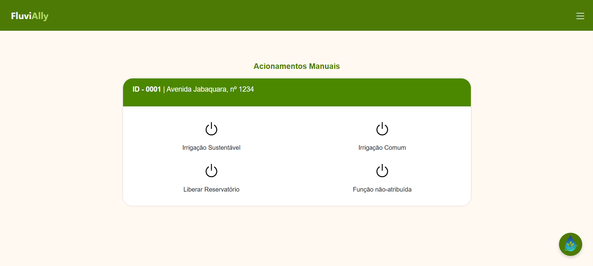
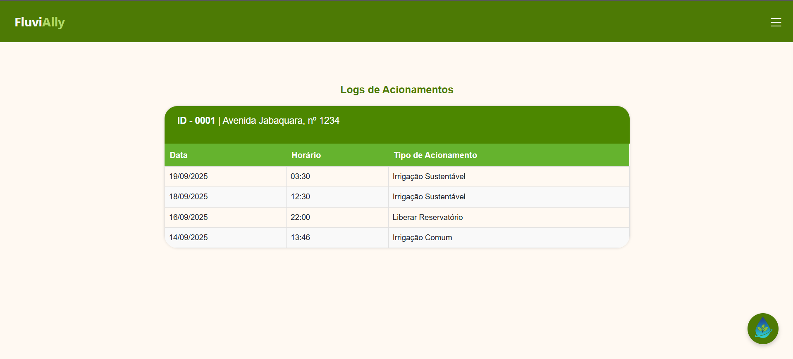
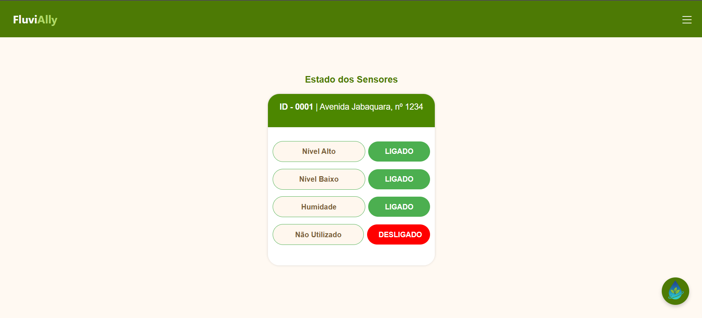
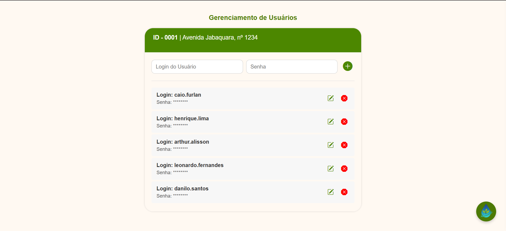
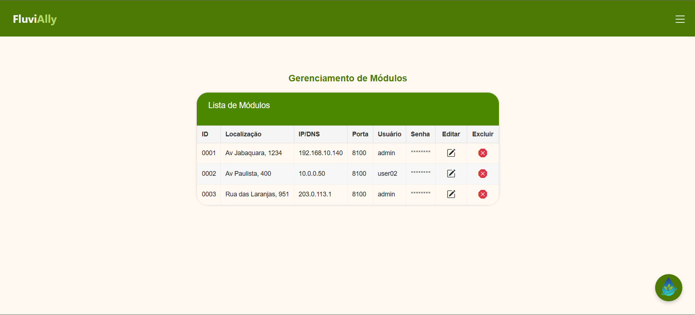

# 🌱 Sistema de Irrigação Automatizada para Hortas Urbanas em Terrenos Abandonados ou em Desuso

## 📘 Visão Geral do Projeto
Este projeto apresenta um **sistema de irrigação automatizado** projetado para transformar terrenos urbanos abandonados ou em desuso em **hortas produtivas, sustentáveis e inteligentes**.

A solução reduz desperdício de água, facilita o monitoramento remoto e incentiva o uso sustentável de espaços ociosos, contribuindo diretamente para os **ODS 2 (Fome Zero e Agricultura Sustentável)** e **ODS 11 (Cidades e Comunidades Sustentáveis)**.

A proposta combina **tecnologia acessível**, **design intuitivo**, **impacto social** e **sustentabilidade urbana**, democratizando o uso de agricultura inteligente em comunidades, escolas e projetos públicos.

- [Visite o meu site Fluvially](https://danilodoes.github.io/fluvially/)

```Usuário: user (sem senha)```

```Usuário: admin (sem senha)``` 

---

# Funcionalidades Principais

O sistema opera em dois níveis de acesso:

- **Usuário (USER)** → acesso às operações básicas  
- **Administrador (ADMIN)** → acesso total e configurações avançadas  

---

# Funcionalidades do Usuário (USER)

Fluxo principal:  
```LOGIN → HOME → Acionamentos Manuais / Logs de Eventos / Estados dos Sensores```

### Acionamentos Manuais  
- Controla manualmente válvulas, bombas e reservatórios.

### Logs de Eventos  
- Lista o histórico de ações e eventos do sistema.

### Estados dos Sensores  
- Mostra leituras de umidade, nível de água, status de válvulas etc.

---

# Funcionalidades do Administrador (ADMIN)

Além de tudo que o usuário comum possui, o ADMIN também conta com:

### CRUD Módulos Controladores da BRAVAS Tecnologia  
- Adicionar, editar e excluir módulos físicos conectados.

### CRUD Usuários  
- Gerenciar contas, permissões e credenciais.

### CRUD Sensores  
- Cadastrar, editar ou remover sensores.

---

# Design e Usabilidade (Heurísticas de Nielsen)

Focado em três heurísticas principais:

### 1. Consistência e Padronização  
- Padrões visuais unificados para ícones, botões e cores.

### 2. Reconhecimento em vez de Memorização  
- Navegação intuitiva orientada por ícones e rótulos.

### 3. Design Estético e Minimalista  
- Layout limpo, sem excesso de informação.

---

# Impacto Social e Sustentável

A solução promove:

- Redução do desperdício de água  
- Criação de hortas urbanas comunitárias  
- Revitalização de terrenos ociosos  
- Incentivo governamental (ex: redução de IPTU)  
- Agricultura inteligente de baixo custo  

---

# Características Técnicas do Projeto

O desenvolvimento adotou uma abordagem híbrida, combinando tecnologias web modernas com scripts otimizados para comunicação direta com o hardware.  
A aplicação não foi construída sob o conceito estrito de “Mobile First”, porém utiliza uma arquitetura totalmente **responsiva**, funcionando perfeitamente tanto em **desktops** (gestão administrativa) quanto em **dispositivos móveis** (monitoramento em campo).

## Tecnologias e Arquitetura

### 🔹 **Front-End**
- **HTML5**, **CSS3** e **JavaScript**
- **Bootstrap** como framework de responsividade  
  - Permite adaptação automática da interface conforme o dispositivo  
  - Essencial para operação mobile por operadores em campo

### 🔹 **Back-End (API)**
- **Node.js + Express**  
- Arquitetura **MVC**  
- Responsável por:
  - Regras de negócio  
  - Autenticação  
  - Gestão de usuários  
  - Registro de logs  
  - Gerenciamento de módulos e sensores  

### 🔹 **Worker (Integração com o Hardware)**
Microsserviço desenvolvido em **JavaScript puro (Vanilla JS)**.  
Função principal:

- Executar **polling a cada 20 segundos** no módulo controlador   
- Capturar o estado dos sensores  
- Encaminhar comandos para o hardware  
- Operar de forma isolada da API para melhor desempenho  

Sem uso de frameworks pesados → mais leve, rápido e eficiente.

### 🔹 **Módulo (Hardware)**
Dispositivo físico semi-automático, com firmware próprio, responsável por:

- Leitura direta dos sensores:
  - S1: Umidade do solo  
  - S2: Nível de água  
  - S3: Estado das válvulas  
- Execução dos comandos enviados pelo Worker  
- Comunicação assíncrona com a API

### 🔹 **Comunicação: Broker NATS**
Toda comunicação entre **Worker ↔ API** utiliza o **NATS**, garantindo:

- Mensageria assíncrona  
- Baixa latência  
- Alta performance  
- Tolerância a falhas  
- Escalabilidade horizontal  
- Independência total entre serviços  

---

# Arquitetura do Sistema

O sistema utiliza uma arquitetura baseada em **microsserviços**, permitindo:

- Modularidade  
- Escalabilidade  
- Independência entre componentes  
- Operação simultânea de múltiplas hortas  

O módulo controlador conta com:

- Sensores de umidade  
- Sensores de nível de água  
- Atuadores e válvulas  
- Comunicação remota via Worker + NATS  

---

# 🖼️ Prints da Interface

### 📌 Tela de Login  


### 📌 Acionamentos Manuais  


### 📌 Logs de Eventos  


### 📌 Estados dos Sensores  


### 📌 CRUD Usuários  


### 📌 CRUD Módulos  


---

# 💡 Resumo Final

Este projeto une tecnologia, sustentabilidade e impacto social para transformar espaços urbanos abandonados em locais produtivos e colaborativos.

Ele entrega:

- 💧 Irrigação inteligente  
- 🌱 Agricultura sustentável  
- 📡 Monitoramento remoto  
- 🧩 Modularidade  
- 🧑‍🤝‍🧑 Participação comunitária  
- 🏙 Revitalização urbana  

---
